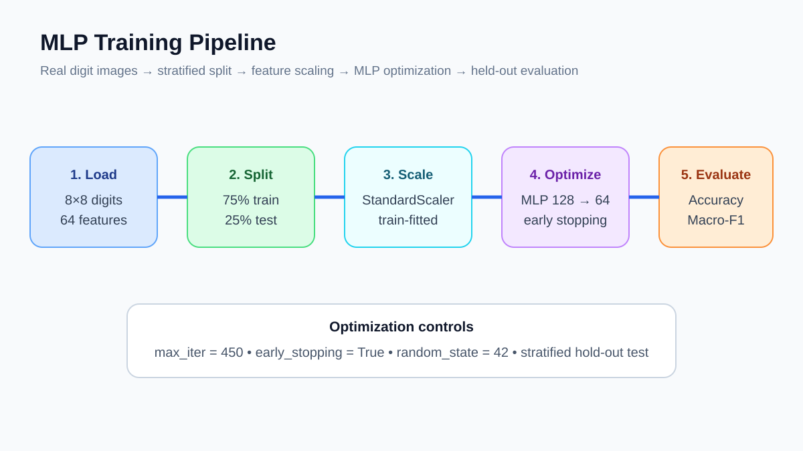
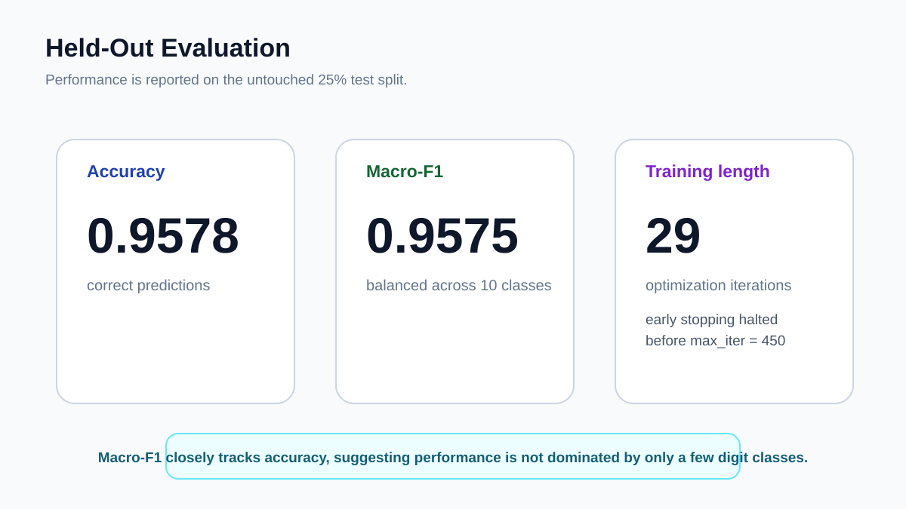

# Web Portfolio Card

## Multilayer Neural Network

**Track:** AI Engineering  
**Difficulty:** ★★★★  
**Dataset:** Optical Recognition of Handwritten Digits  
**Quick description:** Train a compact MLP on real handwritten digit images and inspect optimization behavior and held-out classification performance.

### Suggested website image gallery

### Suggested portfolio copy
This project trains a two-hidden-layer multilayer perceptron on real handwritten digit images using standardized inputs and early stopping. The architecture maps 64 pixel features through 128 and 64 hidden units to 10 digit classes, reaching 95.78% held-out accuracy and 95.75% macro-F1 in 29 optimization iterations. The repository includes executable code, real empirical metrics, reproducibility documentation, and a scientific-style technical report.
