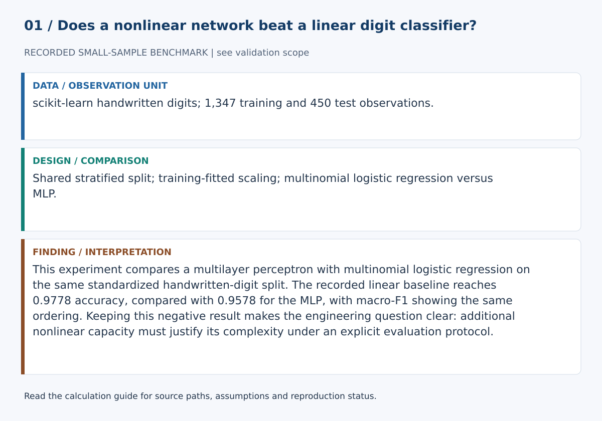
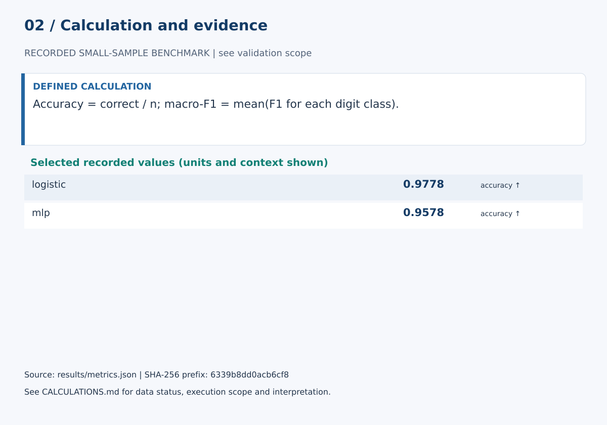

# Multilayer Perceptron vs Linear Baseline on Handwritten Digits

This experiment compares a multilayer perceptron with multinomial logistic regression on the same standardized handwritten-digit split. The recorded linear baseline reaches 0.9778 accuracy, compared with 0.9578 for the MLP, with macro-F1 showing the same ordering. Keeping this negative result makes the engineering question clear: additional nonlinear capacity must justify its complexity under an explicit evaluation protocol.

## Start here

- [Calculations, evidence and verification scope](CALCULATIONS.md)
- [Figure sources and exact numerical paths](docs/figure_spec.json)
- [Working paper](paper/paper.md)
- [Data and provenance](DATA.md)





**Review scope:** The existing suite requires unavailable dependencies; no full-suite pass is claimed. The complete data/model experiment was not rerun in this review.

## Detailed project documentation

[](https://github.com/devissaputra/mlp_neural_network/actions/workflows/ci.yml)


**Category:** AI Engineering

A compact neural-network experiment with one rule: **the MLP has to earn its complexity by beating a strong linear baseline**.

## Data

The scikit-learn handwritten-digits dataset contains:

- 1,797 grayscale images
- 8 × 8 pixels
- 64 numerical inputs
- 10 classes
- stratified 75/25 train/test split
- seed 42

## Models


Both models use standardized inputs.

### Linear baseline
Multinomial logistic regression.

### MLP
```text
64 inputs
  ↓
128 hidden units
  ↓
64 hidden units
  ↓
10 output classes
```

The MLP uses early stopping and a maximum of 450 optimization iterations.

## Recorded results


| Model | Accuracy | Macro-F1 |
|---|---:|---:|
| Logistic regression | **0.9778** | **0.9776** |
| MLP | 0.9578 | 0.9575 |

The MLP stopped after 29 optimization iterations.


The important result is that the neural network does **not** win here. The dataset is small, low-resolution, and already close to linearly separable after scaling. That makes this a better engineering lesson than a cherry-picked neural-network victory: extra model complexity should be justified by evidence.

## Run

```bash
python -m venv .venv
source .venv/bin/activate
pip install -r requirements.txt
python src/run_experiment.py
```

## Test

```bash
pip install pytest
pytest
```

Tests verify deterministic data splitting, baseline/MLP metric output, and import-safe execution.

## Why the negative result is useful

The MLP loses to logistic regression on this split. I kept that result because it answers the actual engineering question: does the extra nonlinear capacity buy anything here? On this small, low-resolution dataset, it does not.

That makes the baseline more than a formality. It prevents the project from turning into a demonstration where the neural network is assumed to be better before the experiment starts.

## What I would test next

I would repeat the comparison across several seeds, tune both models with nested validation, add confidence intervals, and then move to a larger image dataset where nonlinear representation learning has more room to help.
